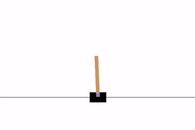

#### 基于DQN的倒立摆

效果如下：



代码解释：

定义一个多层感知机网络压缩状态信息

```python
class QNetwork(nn.Module):
    def __init__(self, state_dim,action_dim):
        super().__init__()
        self.fc1 = nn.Sequential(
            nn.Linear(in_features=state_dim,out_features=64),
            nn.ReLU(),
            nn.Linear(64,64),
            nn.ReLU(),
            nn.Linear(64,action_dim)
        )
    def forward(self,x):
        return self.fc1(x)
```


智能体代理相关代码解释：
```python
class DQNAgent:
    def __init__(self,state_dim,action_dim):
        self.q_net = QNetwork(state_dim,action_dim)  ## 
        self.target_qnet = QNetwork(state_dim,action_dim)
        self.target_qnet.load_state_dict(self.q_net.state_dict())
        self.best_net =  QNetwork(state_dim,action_dim)   # 最优奖励网络
        self.optimizer = optim.Adam(params=self.q_net.parameters(),lr=1e-3)  # 优化器
        # 双端队列
        self.repaly_buffer = deque(maxlen=10000)  ## 缓冲区存储容量
        self.batch_size = 64    # 最小训练batch
        self.gamma = 0.99   ## 折现率
        self.epsilon = 0.1  ## 探索率
        self.updata_target_freq = 100   #更新间隔
        self.step_count = 0    
        self.best_reward = 0   # 记录最佳奖励
        self.best_avg_reward = 0  # 记录平均奖励
        self.eval_episodes = 5   # 评测间隔
    def choose_action(self,state):  # 选择行动
        if np.random.rand() < self.epsilon:  # 随机选择两个动作
            return np.random.randint(0, 2)  # CartPole有2个动作（左/右）
        else: # 选择模型预测的动作
            state_tensor = torch.FloatTensor(state)
            outputs = self.q_net(state_tensor)
            action = outputs.cpu().detach().numpy().argmax()
            return action
        
    def store_experience(self,state,action,reward,next_state,done): # 存储经验
        self.repaly_buffer.append((state,action,reward,next_state,done))
    
    def train(self): #训练
        if len(self.repaly_buffer) < self.batch_size:  # 如果存储的经验小于64，需要继续存储
            return

        batch = random.sample(population=self.repaly_buffer,k=self.batch_size) # 随机挑选存储的数据
        state,action,reward,next_state,done = zip(*batch)

        state = torch.FloatTensor(np.array(state))
        action = torch.LongTensor(action)
        reward = torch.FloatTensor(reward)
        next_state = torch.FloatTensor(np.array(next_state))
        done = torch.FloatTensor(done)

        current_q = self.q_net(state).gather(1,action.unsqueeze(1)).squeeze()

        with torch.no_grad():
            next_q = self.target_qnet(next_state).max(1)[0]
            target_q = reward + self.gamma * next_q  *(1-done)
        loss = nn.MSELoss()(current_q,target_q)
        self.optimizer.zero_grad()
        loss.backward()
        self.optimizer.step()
        
        self.step_count +=1
        if self.step_count % self.updata_target_freq == 0:  # 更新目标q网络
            self.target_qnet.load_state_dict({
                k: v.clone() for k, v in self.q_net.state_dict().items()
            })
    
    def save_model(self,path):  # 保存网络
        if not os.path.exists("./output"):
            os.makedirs("./output")
        torch.save(self.q_net.state_dict(),f=path)
        print("model save success")

    def evaluate(self,env):
        original_epsilon = self.epsilon
        self.epsilon = 0
        totoal_rewards = []

        for _ in range(self.eval_episodes):
            state = env.reset()[0]
            episode_reward = 0
            while True:
                action = self.choose_action(state)
                next_state,reward,done,_,_ = env.step(action)
                episode_reward +=reward
                state = next_state
                if done or episode_reward > 2e4:
                    break
            totoal_rewards.append(episode_reward)

        self.epsilon = original_epsilon
        return np.mean(totoal_rewards)

```

