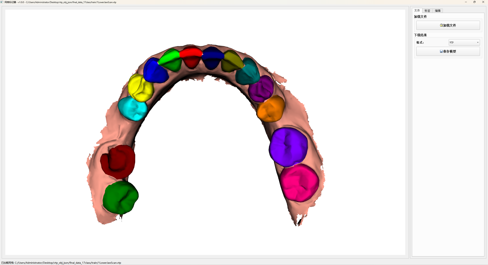

# Mesh Labeler 使用说明

## 刷子功能详细说明

### 1. 启动刷子模式
- 按下 **B** 键进入/退出刷子模式
- 进入刷子模式后，状态栏会显示："刷子模式已激活 - 移动鼠标查看预览，右键拖拽选择区域，按E执行标记"

### 2. 预览功能
- **红色预览区域**：在刷子模式下移动鼠标，会看到红色的网格点显示当前刷子覆盖的区域
- **实时更新**：预览区域会随着鼠标位置实时更新
- **半径控制**：预览区域的大小与设置的刷子半径相对应

### 3. 选择操作
- **右键拖拽**：按住右键并拖拽鼠标来选择区域
- **累积选择**：可以多次右键拖拽来扩大选择区域
- **擦除选择**：按住 **Ctrl + 右键拖拽** 可以从已选择的区域中擦除部分区域

### 4. 刷子大小调整
- **界面调整**：在"编辑"标签页的"刷子半径"输入框中调整
- **快捷键调整**：
  - **+ 键**：增大刷子（每次增加0.1）
  - **- 键**：减小刷子（每次减少0.1）
  - **Ctrl+鼠标滚轮**：快速调整刷子大小
    - 向上滚动：增大刷子（每次增加0.1）
    - 向下滚动：减小刷子（每次减少0.1）
- **实时预览**：调整刷子大小时会立即看到预览区域的变化
- **范围限制**：刷子半径范围 0.1 - 10.0

### 5. 填充功能
- **Shift + 左键**：点击一个背景区域（标签为0），会自动选择所有连通的背景区域
- **智能填充**：只填充标签值为0的连通区域，不会跨越已标记的区域

### 6. 执行标记
- **E键执行**：选择好区域后，按 **E** 键将选中的区域标记为当前活动标签
- **清除选择**：按 **C** 键清除当前选择，重新开始选择

### 7. 撤销功能
- **Ctrl + Z**：撤销上一步标记操作
- **自动备份**：每次执行标记前会自动备份当前状态

### 8. 其他功能
- **S键**：显示/隐藏标签ID号码
- **L键**：开启/关闭网格线框显示模式

参考：https://github.com/Tai-Hsien/Mesh_Labeler